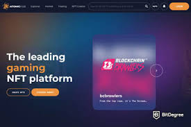

# AtomicAssets

AtomicAssets 是 eosio 区块链技术上的不可替代代币 (NFT) 的标准。 任何人都可以利用 AtomicAsset 标准来标记和创建数字资产。 NFT 数据和所有权保存在区块链上并且不可变。

#### 用户没有 RAM 成本

RAM 成本由创建资产的 dapp 全额支付。即使在转移资产时，这也保持不变。最终用户必须为自己的范围支付的最大值是 112 字节，即使这样也可能很少需要。这也意味着 AtomicAssets 完全没有索赔。转移是即时的，不需要用户采取进一步的行动。

#### 用代币支持资产

资产可以由标准的可替代代币（例如 EOS / WAX）支持。这些代币只能通过销毁资产来释放，从而允许 dapp 为其资产提供有保证的内在价值。

#### 强大的贸易优惠

AtomicAssets 具有双边交易报价的本机实现（类似于 Steam 或 WAX Express Trade）。这允许通过单个操作创建和接受报价。优惠的实施还允许不需要将所有权转移到市场合同的点对点市场。

#### 数据序列化

AtomicAssets 使用自定义构建的序列化，与传统方法（例如 JSON 字符串）相比，它显着降低了 RAM 成本。序列化在合约内完成，保证没有损坏的数据进入区块链。

#### 模板

资产可以有模板，模板可以自己存储数据。这允许将相似的资产组合在一起，这意味着您可以通过不必为每个资产单独存储相同的数据来节省 RAM。

#### 最低的固定 RAM 成本

创建资产只需要 151 个字节（其中 112 个用于必要的索引）。此外，每个令牌所有者都需要有一个范围，该范围需要 112 个字节。

#### 智能合约通知

智能合约可以自动收到与其资产相关的任何相关事件的通知。这使他们能够使资产成为他们游戏中不可或缺的一部分，而不仅仅是静态代币。

