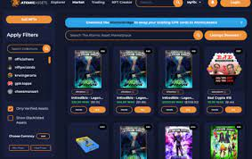

# AtomicMarket

AtomicMarket 允许开发人员使用 AtomicAssets NFT 标准构建 NFT 市场，而无需智能合约或区块链知识。 NFT 流动性在所有市场之间共享，因此用户可以在他们最喜欢的任何市场上列出和购买

## 什么是原子市场？

AtomicMarket 是一个共享流动性 NFT 市场智能合约，被多个网站使用，为用户提供最佳体验。共享流动性意味着在一个市场上上市的所有东西也会在所有其他市场上展示。

.png)
