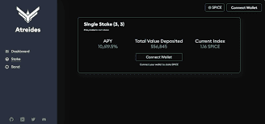

# AtreidesDAO

AtreidesDAO 是 Oasis 协议上的去中心化储备货币。&nbsp;

为了长期繁荣，OHM 分叉不能只是复制储备货币机制并收工。奥林巴斯创建的绑定和堆叠机制允许协议积累资金，但它本身并不是最终目标。这些机制和由此产生的国库应该在更广泛的目的上发挥作用，否则，它会很快消失。

在这篇文章中，我们将首先强调我们打算如何使用金库在 Oasis 生态系统中产生收益，然后我们将如何为 SPICE 提供更广泛的效用，而不是简单地获得收益。

## 提供稳定币流动性

储备货币协议的长期目标是增加其国库，以维持为其堆垛机提供的收益。一开始，大部分利润将来自出售债券，但后来，该协议需要使其收入来源多样化，以使收益率可持续。从历史上看，这些新的收益来源要么来自通过类似 Aave 的协议借出超额准备金，要么来自投资于其他协议并期望获得利润。这些都是让财政部发挥作用的好方法，AtreidesDAO 也可能会做这些事情。但一开始，我们将关注另一个收益来源：提供稳定币流动性。

我们将使用我们的超额准备金来提供深度稳定币流动性。这非常适合 AtreideDAO 的资金库，因为它提供了稳定的收益，进一步复合和增长了资金库，而流动性有利于整个 Oasis 生态系统。这些收益率也几乎没有风险，因为国库仍存储在稳定币中，稳定币流动性几乎不会受到无常损失的影响。另一个优势是它是一种已经可用的收益来源，我们不需要等待在 Emerald ParaTime 上启动贷款协议。

现在国库有了生产性用途，我们可以更进一步，为我们的原生代币 SPICE 提供深度效用。
