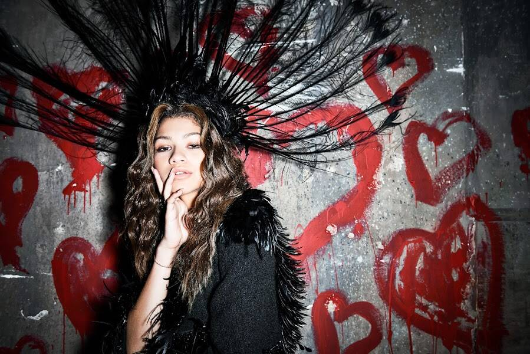

# The Auerbach Collection. The Process Series.

Captured Moment：Master's Process 将包含两个 NFT drop：一个用于 Process 照片，它揭示了 Master 作品制作过程中所涉及的微妙幕后构造，另一个用于上述 Masters 的 1/1s。 持有 Process Series 的照片将允许您加入 Auerbach 即将推出的 NFT 摄影 Discord（专注于 NFT 摄影和风格方面最热门的对话），并允许收藏家参与 Masters Series 拍卖。

弗雷德里克·奥尔巴赫直率、真诚、亲切； 一个直接的镜头，没有在他的作品上投射任何戏剧性——准确地提取他需要的戏剧性。 他不是星星，而是捕捉和反射星光的精密仪器。 这种方法，扩展到名人摄影，提高了表现他的主题的je ne sais quoi 的能力。 奥尔巴赫并没有愣住，他瞥了一眼，他对拍摄对象内在速度的天生感觉——他们不仅是人，而且完全具备人格——使他的照片具有惊人的亲密感。 奥尔巴赫的秘密似乎很简单，但实际上并非如此：他从不破坏性格。

