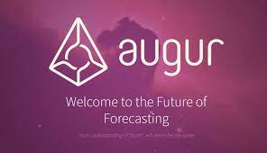
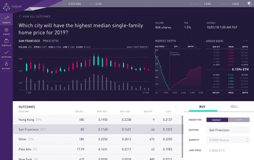

# Augur

Augur 是一个基于以太坊区块链的去中心化预言机和预测市场协议。

## 今天的投注被破坏和剥削。

今天的博彩业以快速致富的承诺进行交易，利用书中的每一个技巧**从客户那里获取最大价值。**

同时，他们最好的投注者会因**降低限额和关闭账户而受到惩罚。**

“基于区块链的预测市场可能是足以抵消不正确信息在社交媒体上传播的强大力量。它们给予人们寻求真相的经济激励，然后用假名和去中心化的双重盾牌保护他们。”

### 最好的赔率 和最低的费用。

用户通过低费用和最佳赔率保留比任何其他交易所更多的奖金。奥古尔没有削减。

### 全球访问

Augur 是一个点对点的去中心化交易所，可实现对其市场的普遍和透明的访问。

### 保证支付

Augur 由以太坊提供支持，使支付能够作为一个自动化流程运行，任何个人或组织（包括 Augur）都无法干预。

