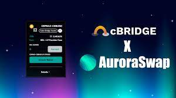

# AuroraSwap

AuroraSwap 的设计基于 Uniswap 恒积自动做市商 (AMM)。 在 AMM 中，流动性提供者只需存入一对代币，算法就会自动为这对代币做市。 交易者可以轻松地在 AMM 中的代币之间进行交换，并获得交换的保证利率。 AuroraSwap 上的每次掉期都会产生费用，该费用会分配给流动性提供者作为他们的工作报酬。

**AuroraSwap**是极光链上的去中心化交易所（DEX）。

AuroraSwap 的设计基于 Uniswap 恒积自动做市商 (AMM)。在 AMM 中，流动性提供者只需存入一对代币，算法就会自动为这对代币做市。交易者可以轻松地在 AMM 中的代币之间进行交换，并获得交换的保证利率。AuroraSwap 上的每次掉期都会产生费用，作为工作报酬分配给流动性提供者。

