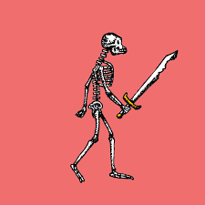
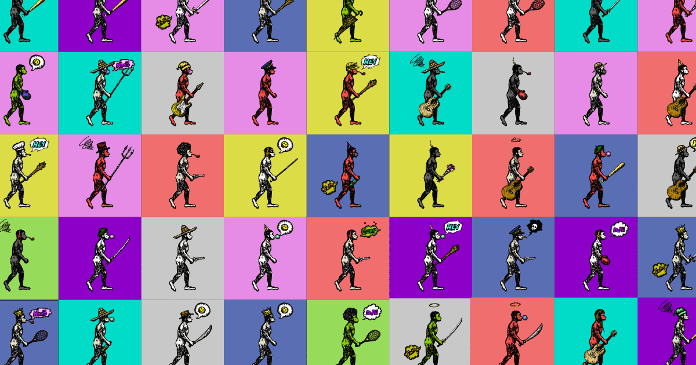

# Australopithecus NFT

多边形网络上的 ERC-721 收藏艺术品。 它们是 2,000 件具有收藏价值的独特艺术品，从 &nbsp;手绘 &nbsp;插图转换为数字。

## 这些是什么

- 它们是称为 ERC721 令牌的收藏品，其中包含随机生成的图像。
- 艺术品从手绘插图转换为数字插图。
- 所有图像都存储在分布式文件系统（IPFS）上。

## 如何购买或出售

- 所有关于南方古猿 NFT 的交易都可以在[OpenSea](https://opensea.io/collection/australopithecus-nft)上进行。

  
