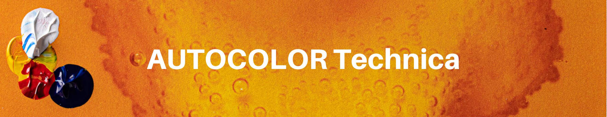

# AUTOCOLOR ART

2500 NFT 免费！ 由人类算法制作和随机化。 0%的版税，只有真正的美学。

什么是AUTOCOLOR ART？
AUTOCOLOR ART 是一个 NFT（不可替代令牌）集合。 存储在区块链上的数字艺术品集合。
▶ AUTOCOLOR ART 代币有多少？
总共有 1,615 个 AUTOCOLOR ART NFT。 目前，445 位所有者的钱包中至少有一个 AUTOCOLOR ART NTF。
▶ 最近卖出了多少AUTOCOLOR ART？
过去 30 天内售出 0 个 AUTOCOLOR ART NFT。
▶ 什么是流行的 AUTOCOLOR ART 替代品？
许多拥有 AUTOCOLOR ART NFT 的用户还拥有 trollstown.wtf、JustDust、SACRIFICE NFT 和 Butt Heads。

