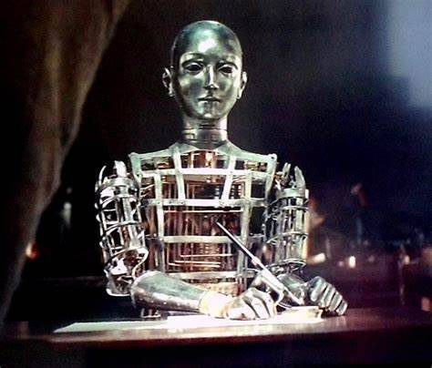

# Automaton

以太坊区块链上五十个独特的元胞自动机实例。 这些确定性模拟是从具有各种随机调色板的种子群体生成的。

Automaton Soldiers Project 是 WW10 中的一个科学项目，之后从未使用过，我们收集了一些在战争中幸存下来的剩余 Automaton，让您有可能获得 Automaton Soldier 伙伴，这将是剩下的少数自动机之一 ，所有维护和保证，但尽量不要紧张！ 一旦我们收集到更多，我们将提供更多的自动机。

