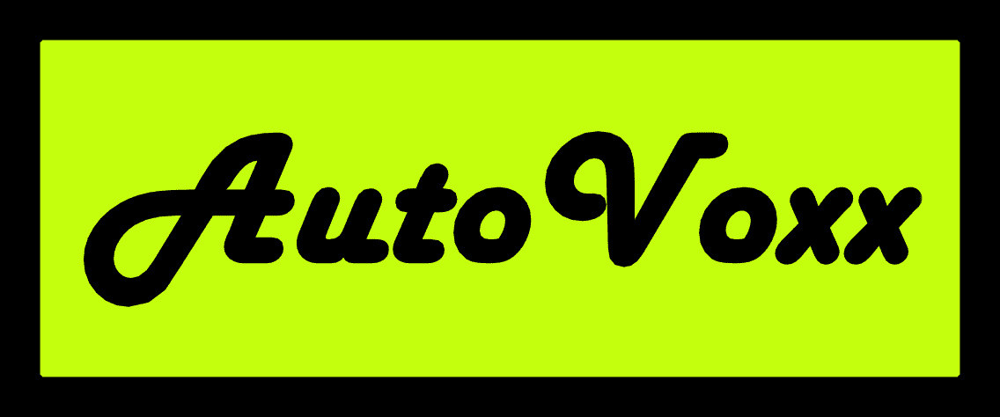

# AutoVoxx

经过点鲨
收藏体素模型层项目。 创建您自己独特的颜色组合，内置数字稀缺性！

在过去的 7 天内没有出售任何自动体素。

元界友好体素艺术（.vox、.obj 和 .fbx 文件），用于沙盒游戏制造商、cryptvoxels 等，作者：@voxelgarden

autovoxel NFT - 常见问题（FAQ）
▶ 什么是自动体素？
autovoxel 是一个 NFT（Non-fungible token）集合。 存储在区块链上的数字艺术品集合。
▶ 存在多少个自动体素标记？
总共有 1 个自动体素 NFT。 目前 3 位所有者的钱包中至少有一个 autovoxel NTF。
▶ 最近卖出了多少自体素？
过去 30 天内售出 0 个 autovoxel NFT。

