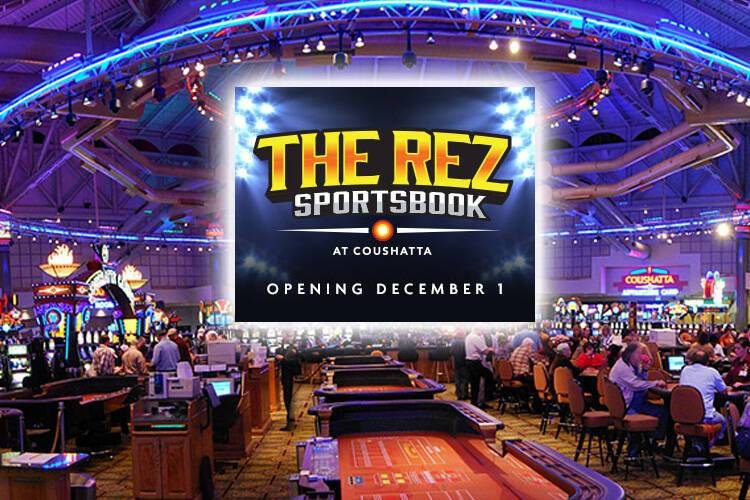

# AV Alpha

艺术家 Franceso Guilberdegeno 的限量 AV Alpha

AV Alpha NFT - 常见问题（FAQ）
▶ 什么是 AV Alpha？
AV Alpha 是一个 NFT（Non-fungible token）集合。 存储在区块链上的数字艺术品集合。
▶ 存在多少 AV Alpha 代币？
总共有 1,129 个 AV Alpha NFT。 目前，63 位所有者的钱包中至少有一个 AV Alpha NTF。
▶ 最近卖出了多少 AV Alpha？
过去 30 天内售出 0 个 AV Alpha NFT。

Alpha Video 将在印度游戏贸易展和大会上拥有来自@Primeview USA 的视频墙和来自@RenderImpact 的内容！ 参观我们的展位#1309
https://hubs.la/Q017NYZ80我们很高兴能前往加利福尼亚参加印度博彩贸易展和大会。 参观 #1309 展位，了解我们提升宾客娱乐场体验的解决方案。 https://hubs.la/Q017NV_r0

