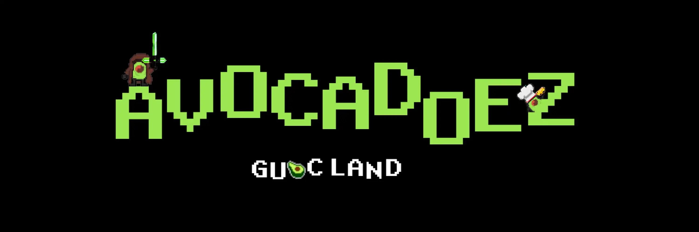

# Avacadoez

7777 AVOCADOEZ 准备成为鳄梨酱 鳄梨酱和所有 vibez！ 鳄梨准备在 GuacLand 发芽

经过关岛主_
9999 AVOCADOEZ 准备成为鳄梨酱，没有不和谐，没有承诺，只有鳄梨酱和所有 vibez！

维基百科，自由的百科全书
跳转到导航跳转到搜索
此条目介绍的是树和果实。关于其他用法，请见“鳄梨 (消歧义)”。
牛油果
时间范围：15–0 Ma
PreꞒꞒOSDCPTJKPgN
中中新世 - 最近
叶子和鳄梨果实的特写图片
鳄梨果实和叶子，留尼汪岛
Avocado Hass - Single and Half.jpg
保护状况
美国波斯变种。番荔枝
美国波斯变种。 dremifolia (Cham. & Schltdl.) S.F.Blake
美国波斯变种。 nubigena (L.O.Williams) L.E.Kopp
鳄梨（Persea americana）是月桂科（Lauraceae）的一种中等大小的常绿乔木，原产于美洲。它因其大而多肉的果实而被广泛种植。这棵树可能起源于墨西哥中南部到危地马拉的高原地区。[3][4][5]它的果实（称为鳄梨、鳄梨梨、鳄鱼梨或俗称 avo）在植物学上是一种含有单个大种子的大浆果。鳄梨树是部分自花授粉的，通常通过嫁接繁殖以保持可预测的果实质量和数量。 

