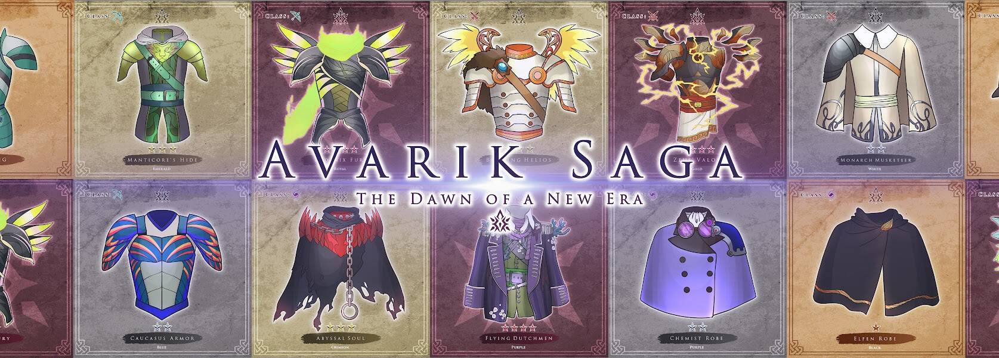

# Avarik Armor

盔甲的稀有度类似于 Avarik Heroes 本身的模型。 盔甲有 4 种稀有度。 稀有性影响游戏中的 2 个关键原则： 更高的护甲基础数据。 增强英雄主动和被动技能的技能威力。

盔甲的稀有度类似于 Avarik Heroes 本身的模型。 盔甲有 4 种稀有度。 稀有性影响游戏中的 2 个关键原则： 更高的护甲基础数据。 增强主动和技能的技能力量

经过
E6BAA4
一件由精灵皮革制成的高雅长袍，具有神秘的魔法防御能力，并在据说精灵居住的森林中激活伪装能力。

