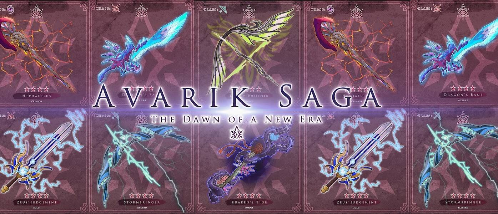

# Avarik Weapons

武器和盔甲的稀有度类似于 Avarik Heroes 本身的模型。 武器和盔甲有 4 种稀有度。 稀有性影响游戏中的 2 个关键原则： 武器和盔甲的基础属性更高。 增强英雄主动和被动技能的技能威力

Avarik Weapons NFT - 常见问题 (FAQ)
▶ 什么是 Avarik 武器？
Avarik Weapons 是一个 NFT（非同质代币）集合。 存储在区块链上的数字艺术品集合。
▶ 有多少 Avarik Weapons 代币？
总共有 127 个 Avarik Weapons NFT。 目前，1,890 名所有者的钱包中至少有一个 Avarik Weapons NTF。
▶ 最昂贵的 Avarik Weapons 销售是什么？
出售的最昂贵的 Avarik Weapons NFT 是 Frozen Aurora Ruby。 它于 2022-07-27（27 天前）以 211 美元的价格售出。
▶ 最近卖出了多少 Avarik 武器？
过去 30 天内售出了 3 个 Avarik Weapons NFT。
▶ 流行的 Avarik 武器替代品有哪些？
许多拥有 Avarik Weapons NFT 的用户还拥有 Avarik Armor、Alien Ape Pixel Party、Fortune Teller Collection V2 和 Avarik Saga Universe。
Avarik 武器社区统计数据

