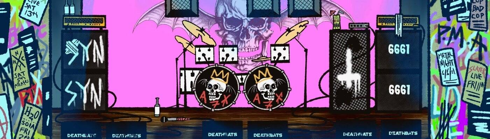

# Avenged Sevenfold Concert Tickets

Aveged Sevenfold 演出的门票。 请在购买前阅读说明并在 avengedsevenfold.io 上回复以进行兑换。 没有 RSVP 将不会授予参赛资格。

在过去的 7 天里，NFT 的七重奏演唱会门票被售出 3 次。 Avenged Sevenfold 演唱会门票的总销售额为 312.87 美元。 一张 Avenged Sevenfold 演唱会门票 NFT 的平均价格为 104.3 美元。 共有 3,615 名 Aveged Sevenfold 演唱会门票拥有者，拥有总供应量 3,901 个代币。

七重奏演唱会门票 NFT - 常见问题（FAQ）
▶ 什么是七重唱演唱会门票？
Aveged Sevenfold 演唱会门票是 NFT（不可替代代币）系列。存储在区块链上的数字艺术品集合。
▶ 有多少复仇的七重奏演唱会门票代币？
总共有 3,901 张 Aveged Sevenfold 演唱会门票 NFT。目前，3,615 位车主的钱包里至少有一张 Avenged Sevenfold 演唱会门票 NTF。
▶ 什么是最昂贵的复仇七重奏演唱会门票销售？
NFT 售出的最昂贵的 Avenged Sevenfold 演唱会门票是 Avenged Sevenfold Concert Ticket #2004。它于 2022-07-02（大约 2 个月前）以 109.8 美元的价格售出。
▶ 最近卖出了多少张复仇的七重奏演唱会门票？
过去 30 天内共售出 19 张 Aveged Sevenfold 演唱会门票 NFT。
▶ 复仇的七重奏演唱会门票多少钱？
在过去的 30 天里，最便宜的七重奏演唱会门票 NFT 售价低于 82 美元，最高售价超过 108 美元。过去 30 天，Avenged Sevenfold Concert Tickets NFT 的中位价格为 99 美元。

