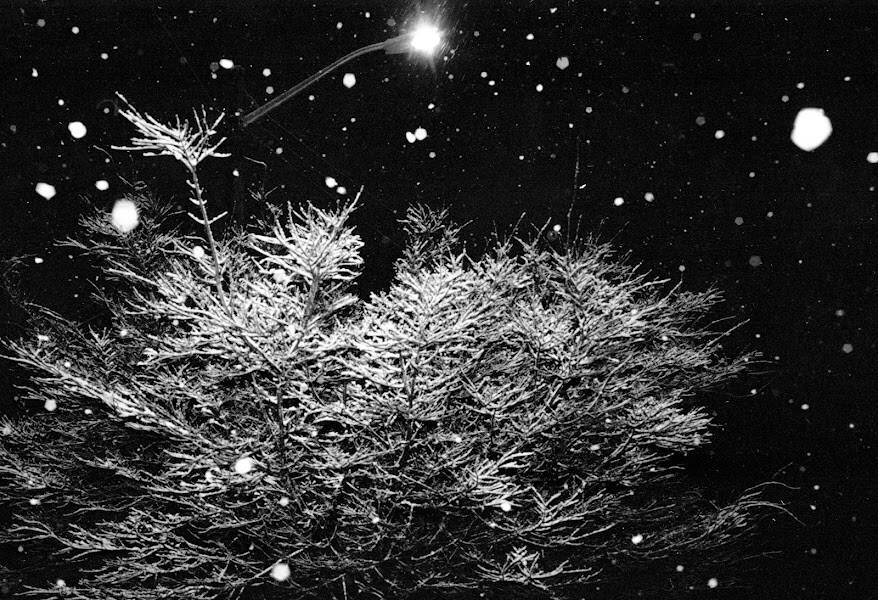

# Avery Adzima - A Night In The Snow

田纳西州诺克斯维尔很少见到足以覆盖地面超过几个小时的积雪。 2022 年 1 月，一场短暂的暴风雪袭击了东海岸，让我得以走出去，在罕见的大雪下拍摄了诺克斯维尔的一些照片。 所有照片都是在同一个晚上拍摄和冲洗的。 Ilford FP4+ 推动了柯达 HC-110 开发的两个站点。

Avery Adzima - 雪中之夜 NFT - 常见问题 (FAQ)
▶ 什么是 Avery Adzima - 雪中之夜？
Avery Adzima - A Night In The Snow 是一个 NFT（不可替代令牌）集合。 存储在区块链上的数字艺术品集合。
▶ 存在多少 Avery Adzima - A Night In The Snow 代币？
总共有 5 个 Avery Adzima - A Night In The Snow NFT。 目前 3 位所有者的钱包中至少有一个 Avery Adzima - A Night In The Snow NTF。
▶ 最近卖出了多少 Avery Adzima - A Night In The Snow？
过去 30 天内共售出 0 个 Avery Adzima - A Night In The Snow NFT。

