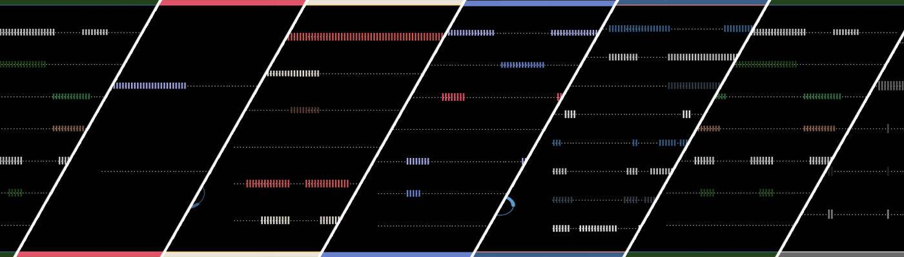

# AVLab B-side

AVLab 是艺术家 Aluan Wang 的视听实验。 当由算法触发时，两种不同的媒体（音频和视频）会创建一个迷人的组合，让观众产生更令人兴奋的感知。

AVLab B 端 NFT - 常见问题（FAQ）
▶ 什么是 AVLab B 面？
AVLab B-side 是一个 NFT（Non-fungible token）集合。 存储在区块链上的数字艺术品集合。
▶ AVLab B 端代币有多少？
总共有 1,024 个 AVLab B 端 NFT。 目前 630 位所有者的钱包中至少有一个 AVLab B 端 NTF。
▶ 最近卖出了多少 AVLab B 面？
过去 30 天内售出了 2 个 AVLab B 端 NFT。

