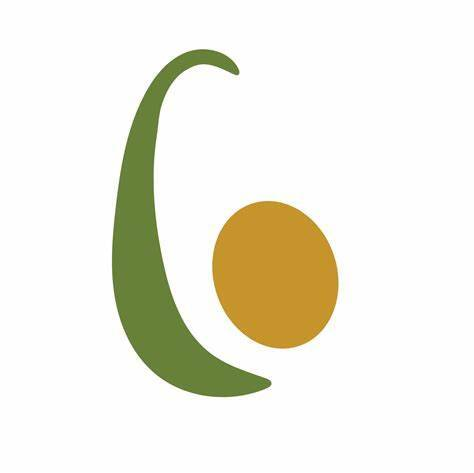

# Avostrology

牛油果被列为十二生肖。

占星术 NFT - 常见问题（FAQ）
▶ 什么是占星术？
Avostrology 是一个 NFT（不可替代代币）集合。 存储在区块链上的数字艺术品集合。
▶ 有多少占星学代币？
总共有 12 个 Avostrology NFT。 目前，25 位所有者的钱包中至少有一个 Avostrology NTF。
▶ 最近卖出了多少占星术？
过去 30 天内共售出 0 个 Avostrology NFT。

经过
占星术
3月21日-4月19日 元素：火 主宰：火星 最大兼容性：天秤座、狮子座

白羊座的优点包括勇敢和热情。 他们的弱点包括不耐烦和咄咄逼人。

白羊座是黄道十二宫的第一个标志，他们通常是第一个在情况下采取行动的人。 由于统治行星火星及其元素火，它们被认为是最活跃的十二生肖之一。 无论年龄多大，他们都拥有年轻的能量。 他们表现出对生活本身的热情，这是其他星座无法比拟的。

