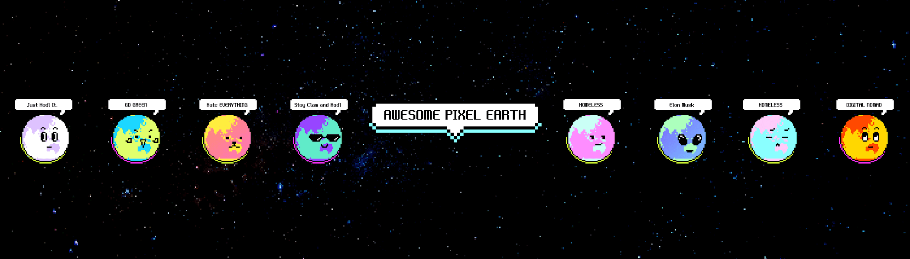

# AWESOME PIXEL EARTH

对于已经进入加密世界的你来说，很棒的 NFT。 地球总是在旋转。 随着地球这样旋转，加密世界已经到来。 也许我们只是困在地球上的一个像素......在链上炫耀你的 Awesome Pixel Earth 身份！Awesome Pixel Earth 是 Klaytn 生态系统上的一个项目。

AWESOME PIXEL EARTH NFT - 常见问题（FAQ）
▶ 什么是真棒像素地球？
AWESOME PIXEL EARTH 是一个 NFT（不可替代令牌）集合。 存储在区块链上的数字艺术品集合。
▶ 有多少 AWESOME PIXEL EARTH 代币？
总共有 1,000 个 AWESOME PIXEL EARTH NFT。 目前 6 位所有者的钱包中至少有一个 AWESOME PIXEL EARTH NTF。
▶ 最近卖出了多少 AWESOME PIXEL EARTH？
在过去 30 天内售出了 0 个 AWESOME PIXEL EARTH NFT。

