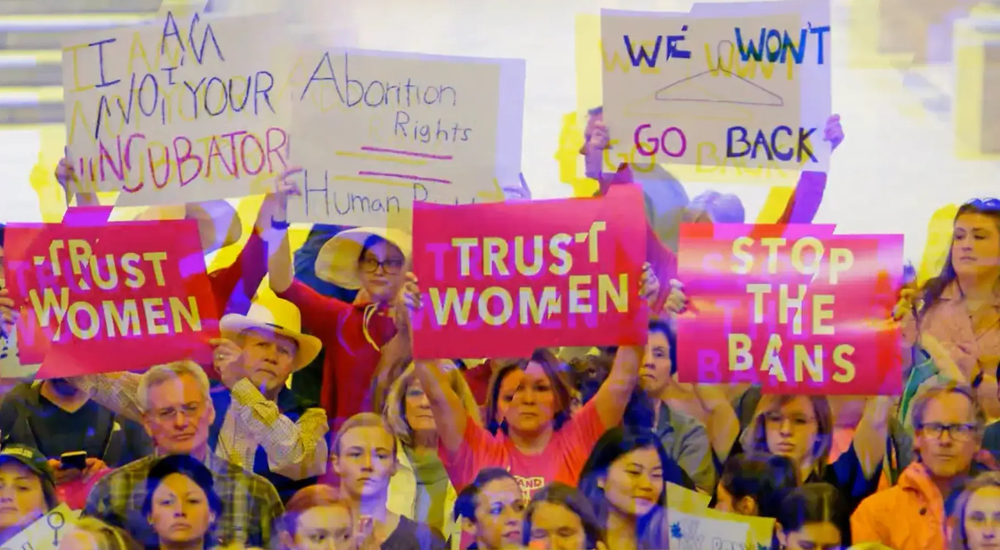

# A WOMANS RIGHT

2022 年 6 月 24 日，美国最高法院裁定 Roe v Wade 败诉，我们很生气。 该系列代表 50 年女性的生殖自由（每年一个 NFT），总供应量为 50。免费薄荷，没有路线图，没有不和谐。 所有二级市场销售都用于支持女性堕胎。 100% 薄荷后显示。

经过336E6E
2022 年 6 月 24 日星期五，美国最高法院推翻了罗诉韦德案，我们很生气！

过去 7 天没有售出 A WOMANS RIGHT。

2022 年 6 月 24 日，美国最高法院裁定 Roe v Wade 败诉，我们很生气。 该系列代表 50 年女性的生殖自由（每年一个 NFT），总供应量为 50。免费薄荷，没有路线图，没有不和谐。 所有二级市场销售都用于支持女性堕胎。 100% 薄荷后显示。

