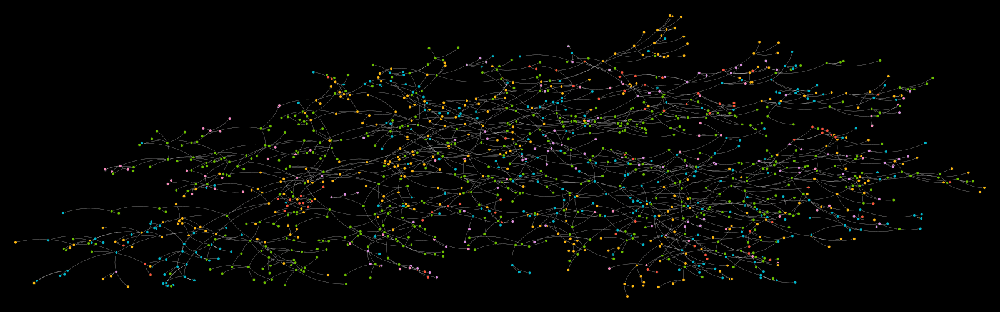

# Axie Generations

Axie Generations 代表从每个 Origin Axie 培育的前 7 代。 正如我们所知，最初的几代人开始了 play-2-earn 运动。 每块的原点轴是一个正方形，是其他点的两倍，你能找到吗？

铸就您的 Axie 历史连接到钱包0 原点轴在进行升级时，铸币会暂停。

经过喇叭DAxie Generations 代表从每个 Origin Axie 培育的前 7 代。 正如我们所知，最初的几代人开始了 play-2-earn 运动。 每块的原点轴是一个正方形，是其他点的两倍，你能找到吗？

