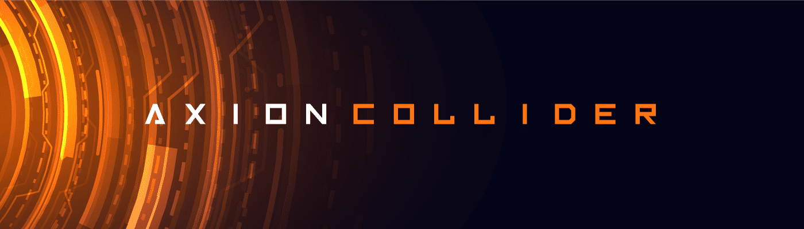

# Axion Collider

有机会将您的 Axion Particles NFT 转换为 Axion Particle Collider 上的实际 AXN 代币！ 每个 NFT 都包含一定数量的粒子，当参与 Collider 时，这些粒子可以在您设置的持续时间内变成质押的 AXN。 他们还将获得比特币红利，如果质押超过 1 年，就可以参与 Axion 的独家 Launchpad！ 了解更多：

▶ 什么是轴子对撞机？
Axion Collider 是一个 NFT（非同质代币）集合。 存储在区块链上的数字艺术品集合。
▶ 存在多少个 Axion Collider 代币？
总共有 6,393 个 Axion Collider NFT。 目前，1,342 位车主的钱包中至少有一个 Axion Collider NTF。
▶ 最近卖出了多少台 Axion Collider？
过去 30 天内售出了 1 个 Axion Collider NFT。

