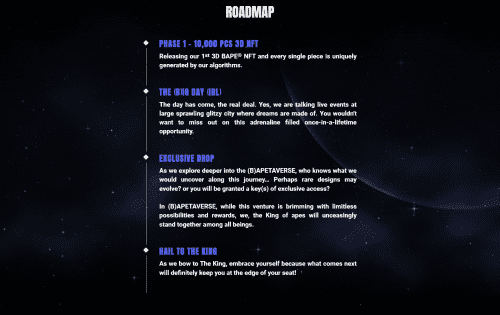
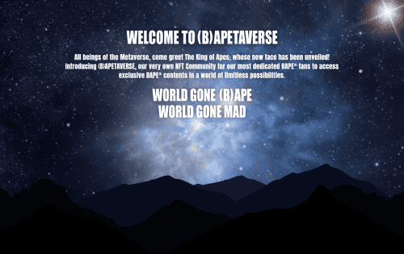

# (B)APETAVERSE

(B)APETAVERSE 是 BAPEFAM 聚集在一起的虚拟世界，将收藏品的目的提升到一个新的水平。 从官方的 A BATHING APE®️ 概念化，人猿之王将成为 (B)APETAVERSE 的头条新闻，并首次揭开他的面庞。 这些独特的高品质 3D 设计 NFT 将帮助会员解锁未来的独家福利、掉落、抽奖、内容等。

继藤原博、Prada、Gucci 等重量级人物之后，BAPE 决定正式进军 NFT 世界。它涉足数字收藏品表明时尚行业希望以一种与挑剔品味水平产生共鸣的方式提升空间。就街头服饰而言，Nike 与 RTFKT 结盟，adidas 与 Bored Ape Yacht Club 结盟，这是为 NFT 增加流行文化可信度的协同行动，越来越多的亚文化同胞找到了自己的参与方式。然而，BAPE 进入 NFT 世界是独一无二的。这个日本品牌可能是推出自己独立项目的最大街头服饰品牌。

恰当地命名为 (B)APETAVERSE——一个授予访问独家内容和其他机会的社区——该系列将包含 10,000 个独特的设计。基于在 Instagram 上发现的涂黑预告图，BAPE 已经放弃了目前主导市场的像素艺术风格，而是大量倾向于更逼真的渲染。

