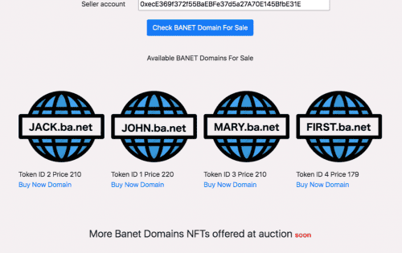
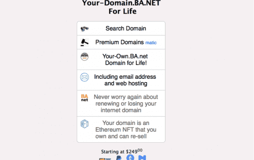

# BA.NET

Your-Own.BA.net 终生域名！ 使用电子邮件（仅限接收）和网络托管。

再也不用担心更新或丢失您的互联网域名

您的域名是您拥有并可转售的以太坊 NFT

BA.net 是一个可以追溯到 1995 年的开创性域名。

它在 2001 年之前托管了一个 ISP Argentina On-Line，

当它被卖给纳斯达克 ISP 时。

后来原所有者在 2005 年重新购买了该域名。

由于其年龄和历史，该域的页面排名很高。

BA.net 是一个简短、令人难忘且易于分享的域名。

它在多种东方语言中也仅表示“互联网”。

BA.net 域指向免费接收电子邮件和 1000 MB GrandHost 托管。

额外的电子邮件、网络和办公工具作为高级服务提供。

