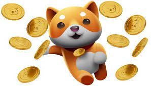
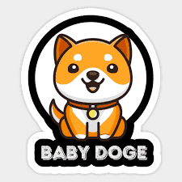

# Baby Doge Token

Baby Doge Token 是币安智能链上的一种实验性去中心化货币。 这是人们在早期阶段拥有代币的机会，当时价格仍然可以相对轻松地成倍增加。 我们在 Pancakeswap 中锁定了 100% 的代币并烧掉了钥匙。 交易也不涉及税收。

# 钱包中的奖励

Baby Doge 很可爱，但有很多 BITE！$Baby Doge 是一种通缩代币，旨在随着时间的推移变得更加稀缺。只需将 Baby Doge 硬币放在钱包中，所有 Baby Doge 的持有者都将赚取更多的 Baby Doge，这些硬币会自动发送到您的钱包。观察您钱包中的 Baby doge 数量的增长，因为 Baby Doge 硬币持有者会自动从 Baby Doge 网络上发生的每笔交易中收取 5% 的费用。社区从每笔交易产生的费用中获得更多的婴儿狗狗币。

