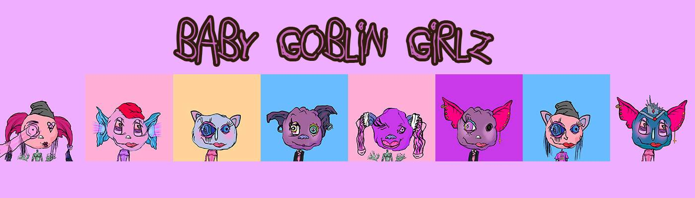

# Baby Goblin Girlz

Baby Goblin Girlz NFT - 常见问题（FAQ）
▶ 什么是小妖精少女？
Baby Goblin Girlz 是一个 NFT（非同质代币）系列。存储在区块链上的数字艺术品集合。
▶ 有多少 Baby Goblin Girlz 代币？
总共有 6,666 个 Baby Goblin Girlz NFT。目前，1,787 位车主的钱包中至少有一个 Baby Goblin Girlz NTF。
▶ 最贵的 Baby Goblin Girlz 促销是什么？
售出的最昂贵的 Baby Goblin Girlz NFT 是 Baby Goblin Girlz #3786。它于 2022-06-07（3 个月前）以 12.5 美元的价格售出。
▶ 最近卖了多少个地精少女宝宝？
过去 30 天内售出了 5 个 Baby Goblin Girlz NFT。
▶ 有哪些流行的 Baby Goblin Girlz 替代品？
许多拥有 Baby Goblin Girlz NFT 的用户还拥有 Based Walrus Collective、 My Little Pug、 0xEthBears和 Bored Weirdo Club。

