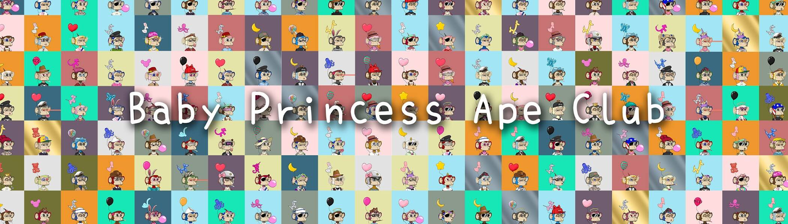

# Baby Princess Ape Club(BPAC)

Baby Princess Ape Club (BPAC) 系列。共有 1814 人，其中 50% 出生在 Baby Princess Ape 俱乐部。

Baby Princess Ape Club(BPAC) NFT - 常见问题 (FAQ)
▶ 什么是婴儿公主猿俱乐部（BPAC）？
Baby Princess Ape Club(BPAC) 是一个 NFT (Non-fungible token) 集合。存储在区块链上的数字艺术品集合。
▶ Baby Princess Ape Club(BPAC) 代币有多少？
总共有 1,814 个 Baby Princess Ape Club (BPAC) NFT。目前 861 位车主的钱包里至少有一个 Baby Princess Ape Club(BPAC) NTF。
▶ 最贵的 Baby Princess Ape Club(BPAC) 促销活动是什么？
最贵的 Baby Princess Ape Club(BPAC) NFT 是 BPAC #1802。它于 2022 年 6 月 12 日（2 个月前）以 11.9 美元的价格售出。
▶ 最近卖出了多少宝贝公主猿俱乐部（BPAC）？
过去 30 天内售出了 3 个 Baby Princess Ape Club (BPAC) NFT。
▶ 有哪些流行的 Baby Princess Ape Club(BPAC) 替代品？
许多拥有 Baby Princess Ape Club(BPAC) NFT 的用户还拥有 The Symbiosis、 Analog Doll、 Cute Toys Universe和 Calia。

