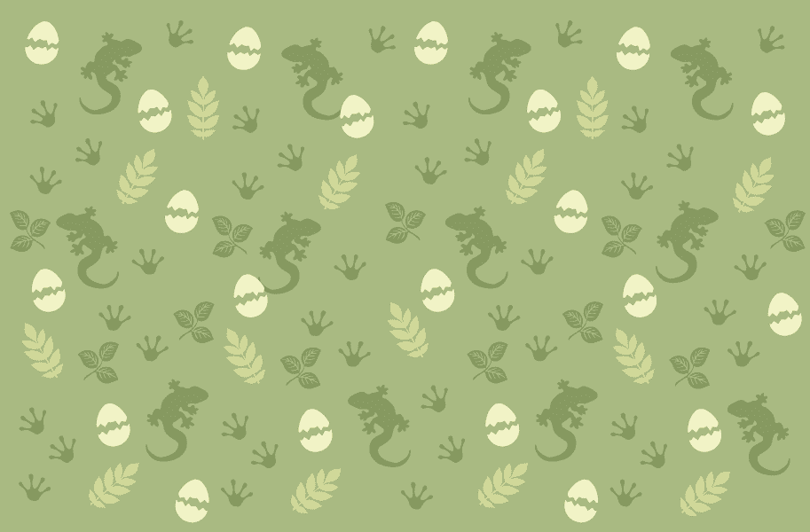

# Baby Reptilian Renegade Lizards

Renegade 蜥蜴的家园星球“SOLANA”受到攻击，在拯救他们的婴儿时，他们设法将 5000 只幼体送到了以太坊区块链上的新家。薄荷你的孵化你的宝宝爬行动物。

Baby Reptilian Renegade Lizards NFT - 常见问题（FAQ）
▶ 什么是小爬虫叛徒蜥蜴？
Baby Reptilian Renegade Lizards 是一个 NFT（非同质代币）系列。存储在区块链上的数字艺术品集合。
▶ 有多少个 Baby Reptilian Renegade Lizards 代币？
总共有 4,000 个 Baby Reptilian Renegade Lizards NFT。目前，279 位所有者的钱包中至少有一只 Baby Reptilian Renegade Lizards NTF。
▶ 最近卖出了多少只爬虫宝宝叛逆蜥蜴？
过去 30 天内售出 0 个 Baby Reptilian Renegade Lizards NFT。
▶ 有哪些流行的 Baby Reptilian Renegade Lizards 替代品？
许多拥有 Baby Reptilian Renegade Lizards NFT 的用户还拥有 INKredible Squids Official、 EL NUMEROS、 Official Crypto Hearts和 DegenOkayBears。

