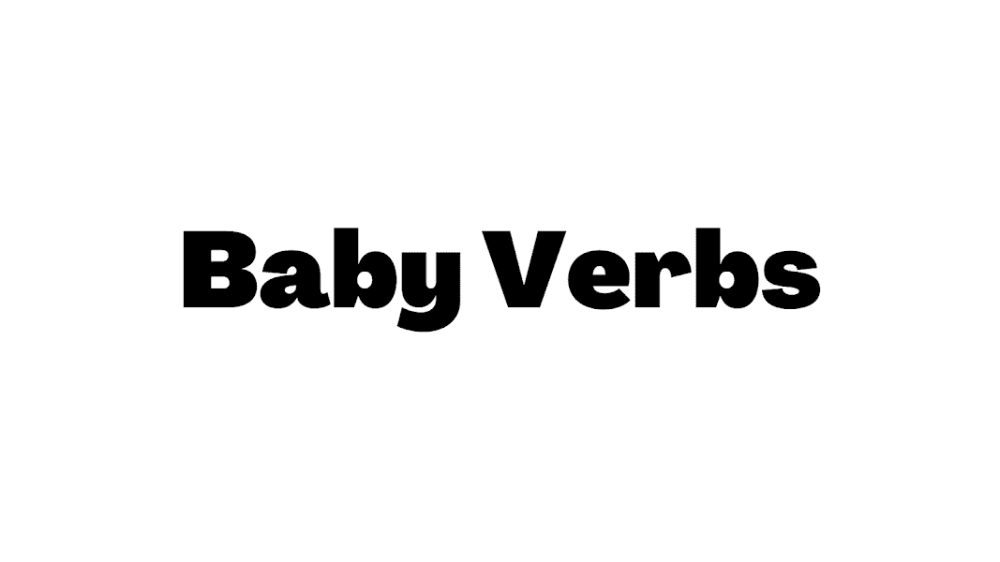

# Baby Verbs

Verbs 抽得太用力了，在以太坊区块链上生成了 4,000 个相同的 Baby Verbs。

婴儿动词 NFT - 常见问题（FAQ）
▶ 什么是婴儿动词？
Baby Verbs 是一个 NFT（不可替代令牌）集合。存储在区块链上的数字艺术品集合。
▶ 存在多少个婴儿动词标记？
总共有 4,000 个 Baby Verbs NFT。目前，248 位所有者的钱包中至少有一个 Baby Verbs NTF。
▶ 最近卖出了多少婴儿动词？
过去 30 天内售出 0 个 Baby Verbs NFT。
▶ 什么是流行的婴儿动词替代品？
许多拥有 Baby Verbs NFT 的用户还拥有 Okay Panda、 Soapy Genesis、 Not Cats Genesis和 Lucky LepreKongz。

