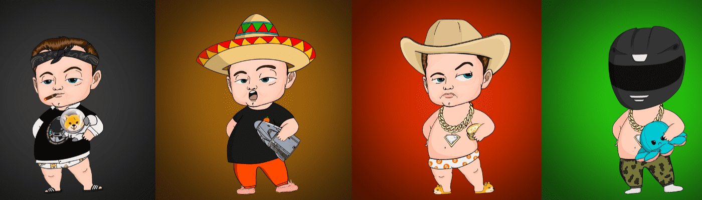

# BabyElonWorld

BabyElon 是 4,444 个 NFT BabyElons 的集合 - 一个生活在以太坊区块链上的独特数字收藏品。他们只是在等待被收养！他们的灵感来自世界上最有影响力的人之一。拥有一个 BabyElon 可以让您访问提供各种福利的独家社区。准备好照顾你的宝宝了吗？

BabyElonWorld NFT - 常见问题（FAQ）
▶ 什么是BabyElonWorld？
BabyElonWorld 是一个 NFT（不可替代令牌）集合。存储在区块链上的数字艺术品集合。
▶ 有多少 BabyElonWorld 代币？
总共有 3,963 个 BabyElonWorld NFT。目前，2,342 位车主的钱包中至少有一个 BabyElonWorld NTF。
▶ 最昂贵的 BabyElonWorld 销售是什么？
最昂贵的 BabyElonWorld NFT 是 Hidden Image。它于 2022-07-01（大约 2 个月前）以 186.6 美元的价格售出。
▶ 最近卖出了多少 BabyElonWorld？
过去 30 天内售出了 7 个 BabyElonWorld NFT。
▶ 什么是流行的 BabyElonWorld 替代品？
许多拥有 BabyElonWorld NFT 的用户还拥有 Milan Quadens 的“LOVE”、 CCC Genesis Packaging-Ganji、 Pixie Jars Rewards和 Siren of the Sea NFT。

