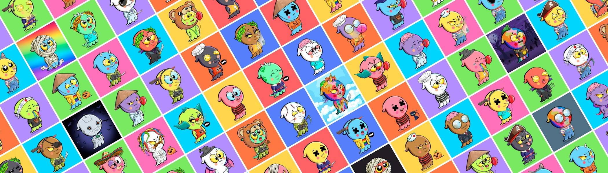

# Baby Ghosts NFTs

Baby Ghosts 是以太坊区块链上 10,000 个独特 NFT 的集合。

加入 Baby Ghosts 幽灵家庭，获得无数独家活动，例如 NFT 索赔、抽奖、社区赠品、独家访问我们的 Web3 工具，以及在我们即将到来的游戏中玩游戏的能力！

Baby Ghosts NFT - 常见问题（FAQ）
▶ 什么是小鬼？
Baby Ghosts 是一个 NFT（非同质代币）集合。存储在区块链上的数字艺术品集合。
▶ 有多少 Baby Ghosts 代币？
总共有 10,000 个 Baby Ghosts NFT。目前，3,932 位车主的钱包中至少有一个 Baby Ghosts NTF。
▶ 最昂贵的 Baby Ghosts 销售是什么？
售出的最昂贵的 Baby Ghosts NFT 是 Baby Ghost #2862。它于 2022-08-11（13 天前）以 59.1 美元的价格售出。
▶ 最近卖了多少宝贝鬼？
过去 30 天内售出了 19 个 Baby Ghosts NFT。
▶ Baby Ghosts 的价格是多少？
在过去 30 天里，最便宜的 Baby Ghosts NFT 销售额低于 21 美元，最高销售额超过 59 美元。Baby Ghosts NFT 的中位价格在过去 30 天内为 42 美元。
▶ 什么是流行的 Baby Ghosts 替代品？
许多拥有 Baby Ghosts NFT 的用户还拥有 The Battle Bunnies-Genesis 300、 Pudgy Ape Fridge Club、 Citizenz Genesis和 Emo Buddies。

