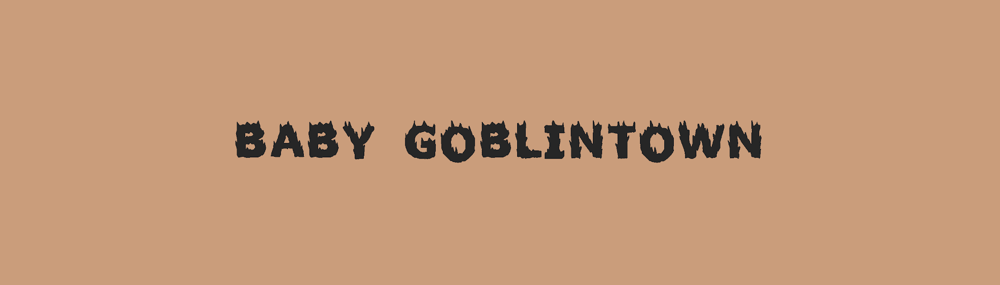

# BabyGoblintown.wtf

BabyGoblintown.wtf NFT 在过去 7 天被售出 1 次。BabyGoblintown.wtf 的总销售额为 2.2 美元。一个 BabyGoblintown.wtf NFT 的平均价格为 2.2 美元。共有 1,275 名 BabyGoblintown.wtf 所有者，总共拥有 5,555 个代币。

GOOO GOOO GAAA GAAA BABABA BaABY GOOB MANA GOOB BABy GOB MANA MANA！5,555 只小地精住在他们的小城。

BabyGoblintown.wtf NFT - 常见问题（FAQ）
▶ 什么是 BabyGoblintown.wtf？
BabyGoblintown.wtf 是一个 NFT（Non-fungible token）集合。存储在区块链上的数字艺术品集合。
▶ 有多少 BabyGoblintown.wtf 代币？
总共有 5,555 个 BabyGoblintown.wtf NFT。目前，1,275 位所有者的钱包中至少有一个 BabyGoblintown.wtf NTF。
▶ BabyGoblintown.wtf 拍卖中最贵的是什么？
售出的最昂贵的 BabyGoblintown.wtf NFT 是 BabyGoblin.wtf #2204。它于 2022-06-14（2 个月前）以 36.1 美元的价格售出。
▶ 最近卖出了多少 BabyGoblintown.wtf？
过去 30 天内售出了 84 个 BabyGoblintown.wtf NFT。
▶ BabyGoblintown.wtf 需要多少钱？
在过去 30 天里，BabyGoblintown.wtf NFT 最便宜的销售额低于 2 美元，最高销售额超过 14 美元。在过去 30 天内，BabyGoblintown.wtf NFT 的中位价格为 5 美元。
▶ 什么是流行的 BabyGoblintown.wtf 替代品？
许多拥有 BabyGoblintown.wtf NFT 的用户还拥有 baby goblinz、 Moon Goons Official、 AIBoredApe和 Monster Bear Club (Okay Kaiju Bears)。

