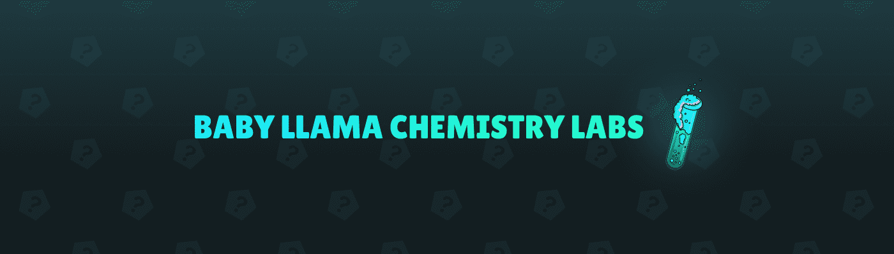

# Baby Llama Chemistry Labs

当不明飞行物落入秘鲁的虚拟宇宙时，所有被收养的小羊驼都过着平静的新生活。里面，不明飞行物充满了一种奇怪的未知血清。一直好奇的骆驼，恰巧踩到了这种血清，暴露了出来，立刻变成了异类物种！答对了！这是一种外星人血清，可以改变任何暴露在外星人身上的东西。

Baby Llama Chemistry Labs NFT - 常见问题（FAQ）
▶ 什么是婴儿骆驼化学实验室？
Baby Llama Chemistry Labs 是一个 NFT（不可替代代币）系列。存储在区块链上的数字艺术品集合。
▶ 有多少 Baby Llama Chemistry Labs 代币？
总共有 2 个 Baby Llama Chemistry Labs NFT。目前，1,963 位车主的钱包里至少有一个 Baby Llama Chemistry Labs NTF。
▶ 最近卖出了多少 Baby Llama Chemistry Labs？
过去 30 天内售出了 0 个 Baby Llama Chemistry Labs NFT。

