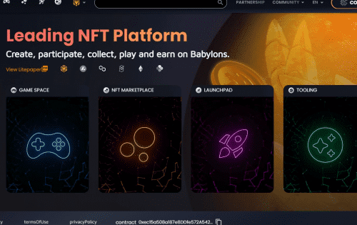
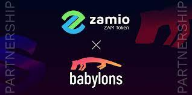

# Babylons NFT Platform & Launchpad

Babylons 是终极 GameFi 目的地、先驱 Launchpad、区块链工具提供商和 NFT 平台，拥有 100 多个游戏合作伙伴和年轻而活跃的 GameFi 爱好者追随者。 Babylons 为其游戏合作伙伴提供 INO 托管、IDO 托管、二级销售服务、区块链基础设施开发，以满足他们的确切需求。 Babylons 拥有一个充满活力的游戏社区，他们渴望参与新游戏项目的私人、公共代币发行和 IDO； 而该平台旨在通过其创新机制使这一过程民主化。

##  游戏玩家的终极目的地 ##

- 代币交换接口
- NFT 市场
- 教育 GameFi 内容
- 启动板和孵化

## 巴比伦的游戏和赚钱游戏

- 可持续游戏经济
- 游戏内 NFT 资产的真正所有权
- 空闲街机类型的链上游戏体验
- 令人上瘾的传说！

## 区块链即服务

- 白标 NFT 市场和 SDK 支持

- 定制的智能合约开发

- 元界和 NFT 工具

- 代币分发服务

  
