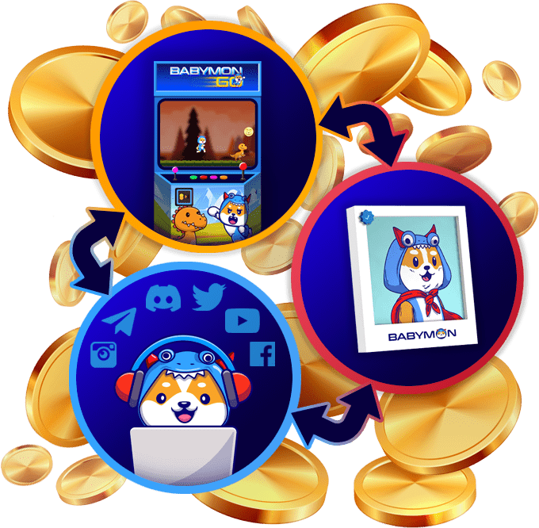

# Babymon

<strong>Babymon 是一种基于区块链的协议，由其自己的 Defi 加密货币资助，这是一种 BEP-20 代币，作为币安区块链上的智能合约。 这种货币将为 Babymon 生态系统内的整个经济提供资金，让持有者可以质押代币和 NFT 以获得 Babymon 质押奖励，并在网络中玩 P2E 游戏时赚取收益。</strong>

## 赚取被动收入...

## 玩 赚,赌注,赚取,参考,赚！

BABYMON 是一个令人兴奋的新区块链项目，它将让您有机会成为聪明而安全的投资者，每天全天赚取被动收入！在享受乐趣并与新的加密货币朋友联系的同时，在您的财富积累之旅中互相帮助。我们在一起！

