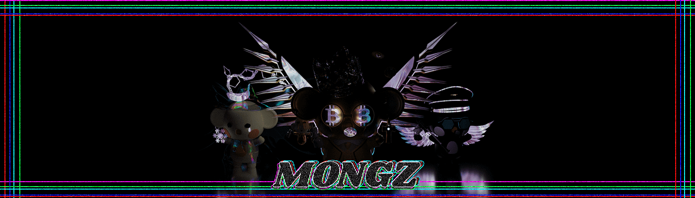

# Baby Mongz OFFlClAL

蒙兹故事系列

在现实生活中开始比特币的人开始转向“香蕉地”。这是一个一切都退化，人们变成猴子的地方。第一次见面开始时“害羞”，有时“迷人”。随着时间的流逝，猴子们开始听到“贪婪”和“欲望”的声音，危机便来到了“香蕉地”。
第一批落户香蕉地的猴猴为了走出危机，来到了“Meta Kongz”，多亏了Meta Kongz的活动，才走出了危机。后来，这个故事将被称为 Klaytn 的以太坊对手。看着这张照片的蒙兹梦想成为“英雄”并开始生孩子以创造更强的DNA，并于2022年2月22日22:22出生。
一个孩子喜欢比特币并分析图表，另一个很贪婪，想要拥有这个和那个。她更喜欢在大自然中，有时会脱掉衣服，害羞的孩子害羞地笑着要求拥抱。一个孩子会以什么样的 DNA 出生成为一个 beigemonz！那个孩子将来会编出什么样的故事呢？

★第一个故事<大战的开始>
“香蕉之地”出现了危机！海外猴子手持以太坊攻击。
蒙兹有危机感，便去找香蕉地的船长梅塔·孔兹寻求帮助。
经过一番激战，Meta Kongz 推出了以太坊，和平来到了“香蕉乐园”。
看到这个的Monzee开始兴奋起来，渴望Metaconz的表现。
许多婴儿蒙兹梦想成为英雄，他们的 DNA 开始蠕动。

★ 第二个故事<以太坊毒气>
一个Baby Monz在看到Meta Kongz的表现后梦想成为英雄，并组建了100人的团队，计划对外国猴子进行反击。

