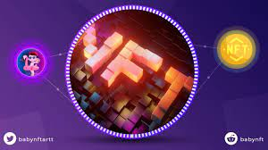

# BABYNFTART

在 NFT 领域。 BabyNFTart 旨在搭建一流艺术家与区块链之间的桥梁，支持原生加密 NFT 艺术家的成长。这就是 BabyNFTart 背后的理念。优秀的团队聚集优秀的人。我们的成员在传统和数字艺术方面拥有丰富的经验。他们的参与将使我们能够不断发现世界各地的 NFT 艺术家，更好地赋能 BabyNFTart，并推动 BabyNFTart 在加密艺术界的崛起

一般说明

在当今世界，用于加密领域的移动应用程序非常重要，因为越来越多的投资者寻求以数字方式完成任务，只需轻按几下即可。

BABYNFTART Token App 将为最终用户提供一种简单的方式来快速访问信息，并让他们保持联系并了解项目及其用例及其各自的进展情况。

BABYNFTART Token App 是 BABYNFTART Token 生态系统内的统一界面，其中包括 BABYNFTART Token Multi-Vendor Store、BABYNFTART Token Clothing Line、Celebrity Meet &amp;问候 BABYNFTART 学院和 NFT 市场。

未来的实用程序最终将被添加到这个生态系统中。

拥有 BABYNFTART 代币应用程序的优势在于它有助于推广，并通过奖励/忠诚度计划增加价值，为投资者提供出色的帮助。这将释放与最终用户建立更好联系的力量，并提高持有者的参与度。

