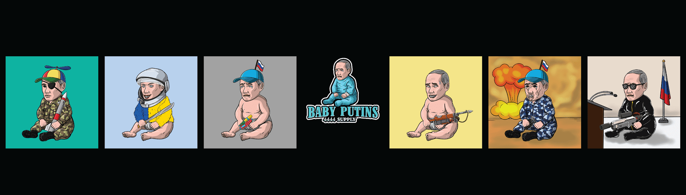

# Baby Putin

Baby Putin NFT 在过去 7 天内售出 1 次。Baby Putin 的总销售额为 0.01 美元。一个 Baby Putin NFT 的平均价格为 0 美元。有 226 名 Baby Putin 所有者，总共拥有 4,444 个代币。

\#婴儿普京已售罄

\##4444 宝贝普京接管了区块链。CC0 艺术，持有人拥有的图像。由 10 层以上的 133 个属性组成，每个普京宝宝都与其他的完全不同。

Baby Putin NFT - 常见问题（FAQ）
▶ 什么是婴儿普京？
Baby Putin 是一个 NFT（非同质代币）集合。存储在区块链上的数字艺术品集合。
▶ 有多少婴儿普京代币？
总共有 4,444 个 Baby Putin NFT。目前，226 位车主的钱包中至少有一个 Baby Putin NTF。
▶ 最昂贵的婴儿普京拍卖会是什么？
售出的最昂贵的 Baby Putin NFT 是 Baby Putin #2782。它在 2022-07-02（大约 2 个月前）以 0 美元的价格出售。
▶ 最近卖出了多少宝贝普京？
过去 30 天内售出了 1 个 Baby Putin NFT。
▶ 有哪些流行的 Baby Putin 替代品？
许多拥有 Baby Putin NFT 的用户还拥有 Poly Meta Frogs Club、 Other Zuki、 Meta Waifus Solana和 GoblinTown。

