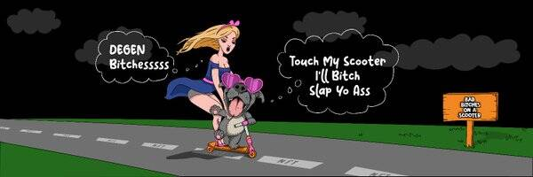

# Bad Bitches On A Scooter Official ETH Collection

滑板车上的坏婊子官方 ETH 收藏 NFT 在过去 7 天内售出 104 次。Bad Bitches On A Scooter Official ETH Collection 的总销售额为 227.57 美元。踏板车官方 ETH 收藏 NFT 上的一个 Bad Bitches 的平均价格为 2.2 美元。滑板车官方 ETH 收藏所有者中有 1,350 个坏婊子，总共拥有 9,992 个代币。

10000 只坏母狗骑在滑板车公园，不担心熊市。这一切都是为了获得乐趣和团结一致地享受社区。

滑板车上的坏婊子官方 ETH 收藏 NFT - 常见问题（FAQ）
▶ 什么是滑板车官方 ETH 收藏中的坏婊子？
滑板车官方 ETH 收藏上的坏婊子是一个 NFT（非同质代币）收藏。存储在区块链上的数字艺术品集合。
▶ Scooter 官方 ETH 收藏代币上有多少坏婊子？
滑板车官方 ETH 收藏 NFT 上总共有 9,992 个坏婊子。目前，1,350 名车主的钱包中至少有一个 Bad Bitches On A Scooter Official ETH Collection NTF。
▶ 滑板车官方 ETH 收藏销售中最贵的 Bad Bitches 是什么？
滑板车上最昂贵的 Bad Bitches On A Scooter 官方 ETH 收藏 NFT 是 Bad Bitches On A Scooter #9999。它于 2022-07-02（大约 2 个月前）以 7.7 美元的价格售出。
▶ 最近卖出了多少辆 Scooter 官方 ETH 收藏中的 Bad Bitches？
在过去 30 天内，Scooter 官方 ETH 收藏 NFT 上售出了 104 个坏婊子。
▶ 滑板车官方 ETH 收藏品上的坏婊子要多少钱？
在过去 30 天内，最便宜的 Bad Bitches On A Scooter Official ETH Collection NFT 销售额低于 0 美元，最高销售额超过 5 美元。过去 30 天，A Scooter Official ETH Collection NFT 上的 Bad Bitches 的中位价格为 2 美元。
▶ 什么是流行的 Bad Bitches On A Scooter Official ETH Collection 替代品？
很多拥有Bad Bitches On A Scooter 官方ETH 合集NFT 的用户也拥有 EDNS、 Okay Panda、 Dodo 的简单笔画和 我是Nobody。

