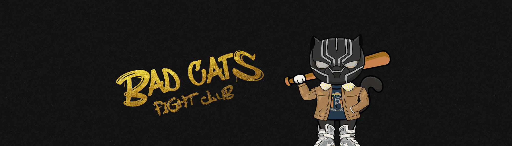

# Bad Cats Fight Club

一个真正的 Alpha 集合，有专门的强力持有者准备在区块链中掀起波澜。

坏猫搏击俱乐部 NFT - 常见问题（FAQ）
▶ 什么是坏猫搏击俱乐部？
Bad Cats Fight Club 是一个 NFT（非同质代币）系列。存储在区块链上的数字艺术品集合。
▶ 有多少 Bad Cats Fight Club 代币？
总共有 777 个 Bad Cats Fight Club NFT。目前，156 位所有者的钱包中至少有一个 Bad Cats Fight Club NTF。
▶ Bad Cats Fight Club 最昂贵的促销活动是什么？
出售的最昂贵的 Bad Cats Fight Club NFT 是 Bad Cat #503。它于 2022 年 6 月 26 日（大约 2 个月前）以 22 美元的价格售出。
▶ 最近卖了多少坏猫搏击俱乐部？
过去 30 天内售出了 1 个 Bad Cats Fight Club NFT。

