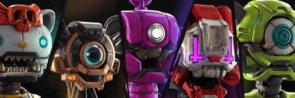

# Bad Face Bots

以太坊区块链上的 5555 个坏脸机器人。

*每个 BFBS 的所有者都拥有其 NFT 的商业使用权。*

坏脸机器人 NFT - 常见问题（FAQ）
▶ 什么是坏脸机器人？
Bad Face Bots 是一个 NFT（不可替代令牌）集合。存储在区块链上的数字艺术品集合。
▶ 有多少 Bad Face Bots 代币？
总共有 5,555 个 Bad Face Bots NFT。目前，2,521 名所有者的钱包中至少有一个 Bad Face Bots NTF。
▶ 什么是最昂贵的 Bad Face Bots 销售？
出售的最昂贵的 Bad Face Bots NFT 是 Bad Face Bots #5479。它于 2022-06-06（3 个月前）以 453.4 美元的价格售出。
▶ 最近卖出了多少坏脸机器人？
过去 30 天内售出了 74 个 Bad Face Bots NFT。
▶ Bad Face Bots 的成本是多少？
在过去 30 天里，Bad Face Bots NFT 最便宜的销售额低于 59 美元，最高销售额超过 127 美元。过去 30 天，Bad Face Bots NFT 的中位价格为 90 美元。
▶ 什么是流行的 Bad Face Bots 替代品？
许多拥有 Bad Face Bots NFT 的用户还拥有 Elysium Shell、 RugPullFrens、 Zenithal Orbit和 Katana N Samurai: The Last Ramen。

