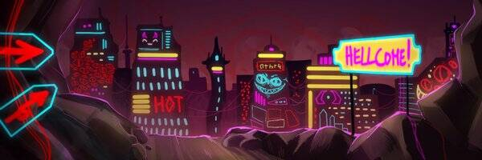

# Bad Girlfriend Project Official

[BGF TOWERS Collection](https://opensea.io/collection/bad-girlfriend-project-towers) 与你的坏女友一起探索地狱并赚取 $STYX！所有坏女朋友都是手绘的，并且有独特的个性！

通过为自己赢得一个坏女朋友，您可以开始赌注以赚取 $STYX。有了足够的 $STYX，您就可以从地狱的金库中解救精英和传说中的坏女友！这些稀有的坏女朋友拥有更高的赌注奖励。准备好和她同居了吗？考虑使用 $STYX 铸造 600 座塔之一。除了为您的地狱后宫提供住所外，当您拥有多达 6 个坏女朋友时，它还提供 3% 的赌注提升。需要一个同伴陪你在塔里吗？考虑买一只魔宠——你的魔法、恶魔般的宠物甚至会进一步提高你的 $STYX 收益！

她是你的地狱门票💋

▶ 什么是坏女友项目官员？
Bad Girlfriend Project Official 是一个 NFT（非同质代币）集合。存储在区块链上的数字艺术品集合。
▶ 坏女友计划官方代币有多少？
总共有 5,840 个 Bad Girlfriend Project 官方 NFT。目前，3,164 位所有者的钱包中至少有一个 Bad Girlfriend Project Official NTF。
▶ 最贵的坏女友计划官方促销是什么？
最昂贵的 Bad Girlfriend Project Official NFT 是 BADGF #5530。它于 2022-07-02（大约 2 个月前）以 219.6 美元的价格售出。
▶ 最近卖了多少坏女友计划官方？
过去 30 天内售出了 1,385 个 Bad Girlfriend Project 官方 NFT。
▶ 坏女友计划官方要多少钱？
过去 30 天，Bad Girlfriend Project 官方 NFT 最便宜的销售额低于 8 美元，最高销售额超过 14 美元。过去 30 天，Bad Girlfriend Project Official NFT 的平均价格为 10 美元。
▶ 什么是流行的 Bad Girlfriend Project Official 替代品？
许多拥有 Bad Girlfriend Project Official NFT 的用户还拥有 Mekabae (Bae Cafe S2)、 BaeCafe、 pablitaslol和 Cloudy Me。

