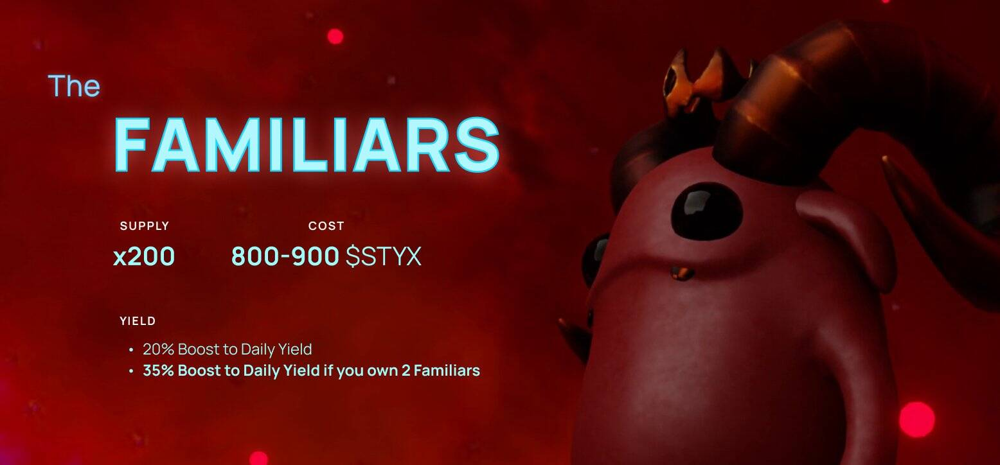

# BGF Towers

BGF Towers NFT 在过去 7 天内售出 1 次。BGF Towers 的总销售额为 54.89 美元。一个 BGF Towers NFT 的平均价格为 54.9 美元。有 96 个 BGF Towers 所有者，拥有 193 个代币的总供应量。

[在这里购买 BGF](https://opensea.io/collection/bad-girlfriend-project-official) 每座塔允许您质押 8 个 BGF。激活最多 3 座塔并赌注最多 24 BGF。

BGF Towers NFT - 常见问题（FAQ）
▶ 什么是 BGF 塔？
BGF Towers 是一个 NFT（不可替代代币）集合。存储在区块链上的数字艺术品集合。
▶ 有多少 BGF Towers 代币？
总共有 193 个 BGF Towers NFT。目前，96 位业主的钱包中至少有一个 BGF Towers NTF。
▶ 最昂贵的 BGF Towers 销售是什么？
出售的最昂贵的 BGF Towers NFT 是 BGF TOWER #37。它于 2022-07-03（大约 2 个月前）以 54.9 美元的价格售出。
▶ 最近卖出了多少 BGF Towers？
过去 30 天内售出了 1 个 BGF Towers NFT。

