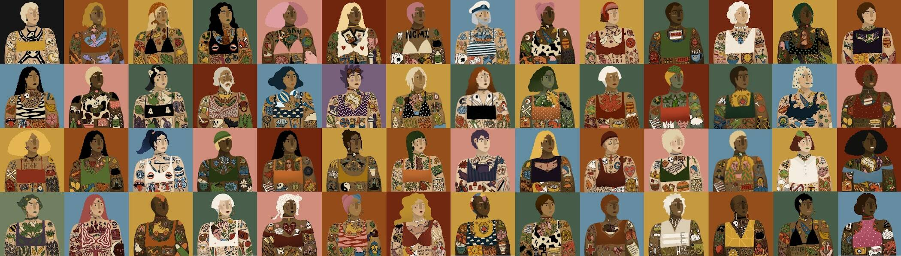

# Bad Tattoos

6000名坏纹身镇居民！一个充满了不寻常的人和奇怪的事情的小镇。没有什么可以保密的。你的想法和欲望体现在纹身上，让所有人都能看到。

坏纹身 NFT - 常见问题（FAQ）
▶ 什么是坏纹身？
Bad Tattoos 是一个 NFT（不可替代代币）系列。存储在区块链上的数字艺术品集合。
▶ 有多少个 Bad Tattoos 代币？
总共有 311 个 Bad Tattoos NFT。目前，180 位车主的钱包里至少有一个 Bad Tattoos NTF。
▶ 什么是最昂贵的 Bad Tattoos 销售？
出售的最昂贵的 Bad Tattoos NFT 是 Bad Tattoos #101。它于 2022 年 6 月 20 日（2 个月前）以 87.8 美元的价格售出。
▶ 最近卖出了多少个 Bad Tattoo？
过去 30 天内售出了 2 个 Bad Tattoos NFT。

