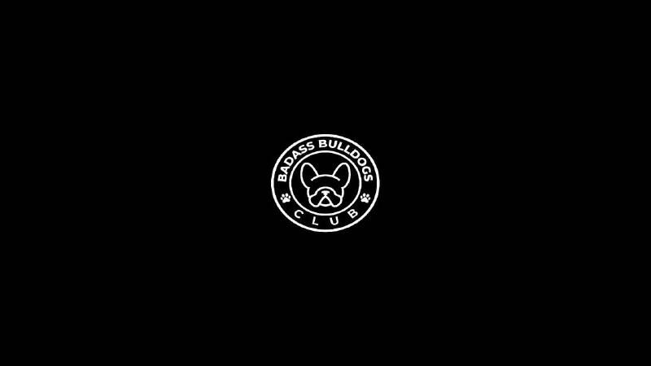

# BADASS BULLDOGS CLUB BB

Badass Bulldogs Club – 由 3333 NFT（不可替代代币）组成。BBC 是不可替代的 Polygon 区块链代币。每个 BBC 代币都以自己的方式独一无二。我们的目标是创建一个覆盖整个元宇宙的大型俱乐部。每只坏蛋斗牛犬都是我们俱乐部的门票。出售所得的所有利润都将用于慈善事业。

BADASS BULLDOGS CLUB BB NFT - 常见问题 (FAQ)
▶ 什么是 BADASS BULLDOGS CLUB BB？
BADASS BULLDOGS CLUB BB 是一个 NFT（不可替代令牌）集合。存储在区块链上的数字艺术品集合。
▶ BADASS BULLDOGS CLUB BB 代币有多少？
总共有 100 个 BADASS BULLDOGS CLUB BB NFT。目前有 2 位所有者的钱包中至少有一个 BADASS BULLDOGS CLUB BB NTF。
▶ 最近卖出了多少 BADASS BULLDOGS CLUB BB？
在过去 30 天内售出 0 个 BADASS BULLDOGS CLUB BB NFT。

