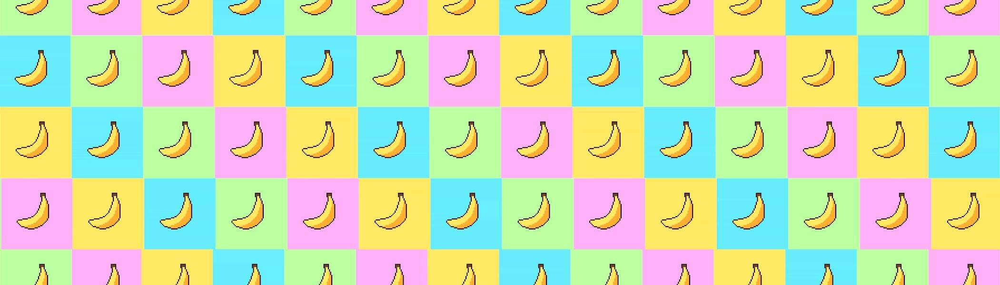

# Bad Banana

我们做坏香蕉。

10 月 28 日系列发布

受普通香蕉的启发，每个 NFT 都是由来自伦敦的三名学生组成的团队手工制作的。

每天采摘新鲜香蕉。

这个集合存在于多边形区块链上。

坏香蕉 NFT NFT - 常见问题（FAQ）
▶ 什么是坏香蕉 NFT？
Bad Bananas NFT 是一个 NFT（不可替代代币）集合。存储在区块链上的数字艺术品集合。
▶ Bad Bananas NFT 代币有多少？
总共有 63 个 Bad Bananas NFT NFT。目前 4 位所有者的钱包中至少有一个 Bad Bananas NFT NTF。
▶ 最近卖出了多少 Bad Bananas NFT？
过去 30 天内售出 0 个 Bad Bananas NFT NFT。

