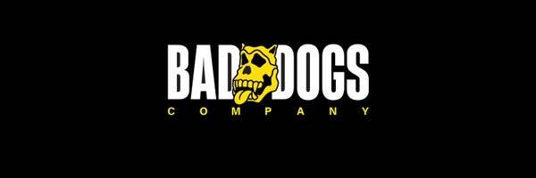

# Bad Dogs Company (Genesis)

Bad Dogs Company 汇集了 888 种不同的设计，并一一创建。它们是生活在以太坊区块链上的独特手绘的 Bad Dogs Company NFT 收藏品。

Bad Dogs Company (Genesis) NFT - 常见问题 (FAQ)
▶ 什么是 Bad Dogs Company（创世纪）？
Bad Dogs Company (Genesis) 是一个 NFT (Non-fungible token) 集合。存储在区块链上的数字艺术品集合。
▶ 有多少 Bad Dogs Company (Genesis) 代币？
总共有 888 个 Bad Dogs Company (Genesis) NFT。目前，114 位所有者的钱包中至少有一个 Bad Dogs Company (Genesis) NTF。
▶ 最昂贵的 Bad Dogs Company (Genesis) 销售是什么？
出售的最昂贵的 Bad Dogs Company (Genesis) NFT 是 BDC#254。它于 2022 年 6 月 29 日（大约 2 个月前）以 190 美元的价格售出。
▶ 最近卖出了多少 Bad Dogs Company (Genesis)？
过去 30 天内售出了 64 个 Bad Dogs Company (Genesis) NFT。
▶ Bad Dogs Company (Genesis) 的成本是多少？
在过去 30 天里，最便宜的 Bad Dogs Company (Genesis) NFT 销售额低于 110 美元，最高销售额超过 610 美元。过去 30 天，Bad Dogs Company (Genesis) NFT 的中位价格为 110 美元。
▶ 什么是流行的 Bad Dogs Company (Genesis) 替代品？
许多拥有 Bad Dogs Company (Genesis) NFT 的用户还拥有 Bae Apes Official NFT、 The ApeDads、 MadMusic 的 STEEZY MUSIC和 RP WOLVES GENESIS。

