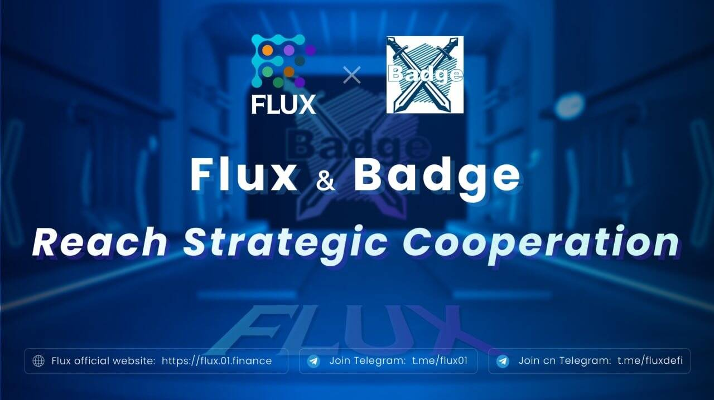

# Badge Project Official

徽章项目的灵感来自著名的“心石”纸牌游戏。Badge NFT 代表一张独特的角色卡。

徽章是一个#NFT，代表了徽章游戏的虚拟角色的身份。 使用 Badge NFT，您拥有#Metaverse 的钥匙

通过不同的人物卡牌组合，通过Play to Earn机制产生有趣的卡牌战斗体验。徽章 NFT 持有者将获得 10,000 美元 XGLD 代币。$XGLD 是 Badge Project 的治理代币，$XGLD 即将上线交易所并自由交易。

🦘Badge 已与 Flux Protocol 合作
  是一种无国界借贷协议，交易费用低，跨链互操作

Badge 和 Flux 协议将在联合 #NFT 上合作

