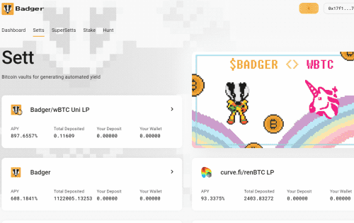
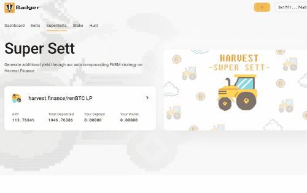

# Badger.Finance

与 dOrg 合作开发

4 位长期加密货币投资者齐心协力，共同创新 DAO 的运营、发布和产品化方式。 到目前为止，我们自己创建并资助了 Badger DAO，目的是在发布时将控制权交给社区。 有些人将继续领导 DAO 的运营，而其他人将继续担任顾问角色。

dOrg 是一个开发集体，用于构建自定义 DAO、DeFi 产品和 web3 工具。 他们帮助领导设计、编码并确保项目立即交付其区块链产品。 他们曾与 Balancer、The Graph、DeversiFi 和 DAOstack 等行业领先的项目合作。

