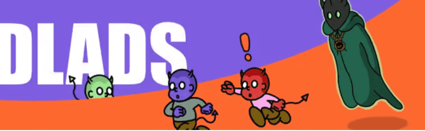

# Badlads

收集 3,000 个 NFT，持有者可以通过 Badlottery 获得独家奖励。尽管这些 NFT 各有各的坏处，但它们不会永远存在……

Badlads NFT - 常见问题（FAQ）
▶ 什么是坏人？
Badlads 是一个 NFT（不可替代令牌）集合。存储在区块链上的数字艺术品集合。
▶ 有多少个 Badlads 代币？
总共有 2,720 个 Badlads NFT。目前，529 位所有者的钱包中至少有一个 Badlads NTF。
▶ 最昂贵的 Badlads 销售是什么？
出售的最昂贵的 Badlads NFT 是 #421。它于 2022 年 6 月 19 日（2 个月前）以 109.8 美元的价格售出。
▶ 最近卖出了多少 Badlads？
过去 30 天内售出了 69 个 Badlads NFT。
▶ Badlads 的价格是多少？
在过去 30 天里，最便宜的 Badlads NFT 销售额低于 5 美元，最高销售额超过 44 美元。过去 30 天内，Badlads NFT 的中位价格为 11 美元。
▶ 什么是流行的 Badlads 替代品？
许多拥有 Badlads NFT 的用户还拥有 JEFF TOWN、 LQDTY、 五行和 Birds Of Disaster。

